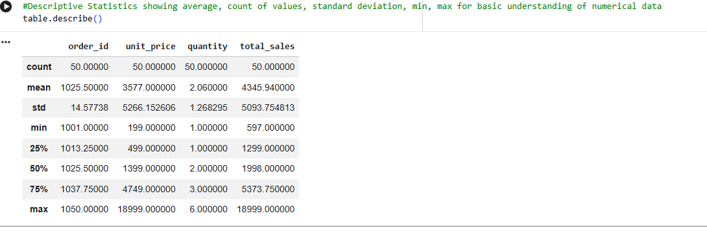

📊 E-Commerce Sales Statistical Analysis (Python)

This project performs end-to-end statistical analysis on eCommerce sales data using Python.
It focuses on extracting business insights such as sales trends, pricing impact, regional performance, and data distribution.

🧰 Tools & Libraries
Python
Pandas
Matplotlib
Seaborn
Scipy
Scikit-learn

📁 Dataset

The dataset contains:

Product details
Sales data
Regions
Order dates

🔍 1. Descriptive Statistics

table.describe()

table.head()

table.info()

Insight: Provides overall understanding of data (count, mean, min, max, structure).

🔗 2. Correlation Analysis

table[['unit_price','quantity','total_sales']].corr()

Insight:

Unit price and total sales → strong positive relationship
Quantity and price → negative relationship

📊 3. GroupBy Analysis

table.groupby('region')['total_sales'].sum()

table.groupby('product_name')['total_sales'].sum().sort_values(ascending=False)

Insight: Identifies top-performing regions and products.

📈 4. Trend Analysis

table['order_date'] = pandas.to_datetime(table['order_date'])
table.groupby('order_date')['total_sales'].sum().plot()

Insight: Shows how sales change over time.

📉 5. Distribution (Histogram)

import matplotlib.pyplot as plt
table['total_sales'].hist()
plt.show()

Insight: Most sales fall within a specific range.

📌 6. Skewness

table['total_sales'].skew()

np.float64(2.002699708975611)

Insight: Positive skew → most values are small, few are very large.

📌 7. Kurtosis

np.float64(3.3415313009629246)

table['total_sales'].kurt()

Insight: Indicates presence of outliers.

🧪 8. Hypothesis Testing (T-Test)

from scipy import stats

south = table[table['region']=='South']['total_sales']
west = table[table['region']=='West']['total_sales']

stats.ttest_ind(south, west)
TtestResult(statistic=np.float64(-2.0996877859829874), pvalue=np.float64(0.04645144173191395), df=np.float64(24.0))

Insight: Checks if difference between regions is statistically significant.

📐 9. Linear Regression

from sklearn.linear_model import LinearRegression

X = table[['unit_price']]
y = table['quantity']

model = LinearRegression()
model.fit(X, y)

model.coef_

array([-0.00011122])

Insight: Shows how price impacts quantity sold.

🚨 10. Outlier Detection (Box Plot)

table.boxplot(column='total_sales')

Insight: Detects extreme values.

🔗 11. Pair Plot (Feature Relationships)

import seaborn
seaborn.pairplot(table[['unit_price','quantity','total_sales']])

Insight: Shows relationships between variables visually.

🎯 Conclusion

This project demonstrates:

Statistical analysis
Business insights
Data visualization
End-to-end workflow
🔑 Keywords

Python | Pandas | Data Analysis | Statistics | Machine Learning | Visualization
